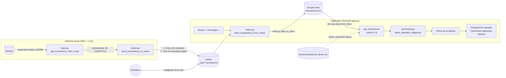
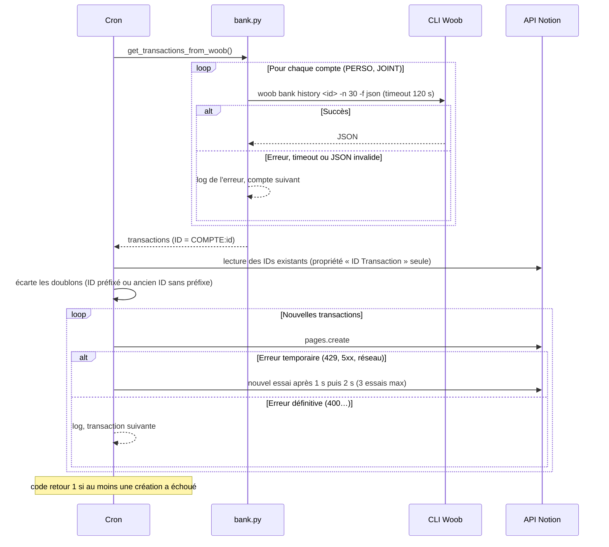
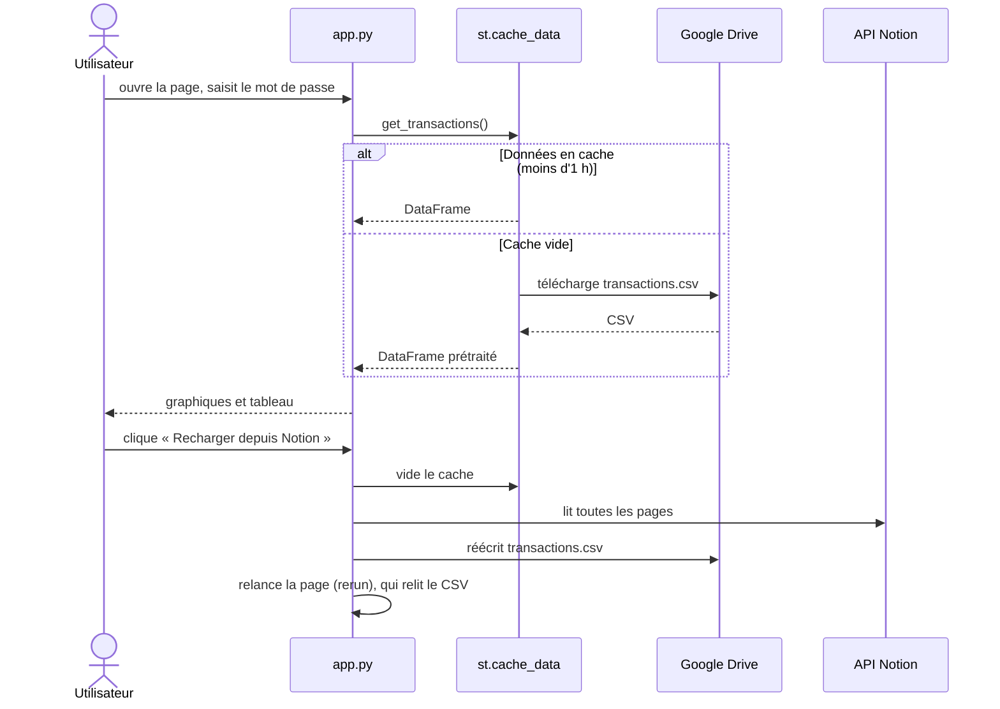

# Architecture

Finance Tracker suit un budget personnel à partir des relevés bancaires. Les données passent par trois étapes : extraction depuis la banque, catégorisation dans Notion, puis visualisation dans Streamlit.

## Vue d'ensemble des flux

Pourquoi un CSV sur Drive entre Notion et l'app ? L'API Notion pagine par 100 pages et devient lente à chaque ouverture du tableau de bord. Le CSV sert de cache persistant : l'app le lit en une requête, et le bouton « Recharger » le régénère à la demande.

## Modules

| Module | Rôle | Dépend de Streamlit |
|---|---|---|
| `bank.py` | Appelle la CLI Woob, parse le JSON, construit les IDs `COMPTE:id` | Non |
| `notion.py` | Lit et écrit la base Notion ; contient le script de synchro (`main`) lancé par cron | Non |
| `drive.py` | Lit et écrit `transactions.csv` sur Google Drive | Non |
| `processing.py` | Fonctions pures : prétraitement, filtres, lissage, agrégats, couleurs | Non |
| `app.py` | Interface : authentification, cache, sidebar, graphiques | Oui |

Seul `app.py` dépend de Streamlit. Le reste est testable unitairement et le script de synchro tourne sans interface.

## Synchronisation banque → Notion

Lancée par `sync_notion.sh` (cron) via `python notion.py`.

## Chargement dans l'application

Les échecs de chargement lèvent une exception `DataLoadError` au lieu de renvoyer `None`. Streamlit ne met pas les exceptions en cache : une erreur passagère (réseau, quota Drive) n'est donc pas mémorisée pendant une heure.

## Modèle de données

Une transaction prétraitée (`processing.TRANSACTIONS_SCHEMA`) :

| Colonne | Exemple | Origine |
|---|---|---|
| `date` | `2026-09-14` | Notion (heure et fuseau retirés) |
| `nom`, `description` | `Carrefour` | Notion (vide si absent) |
| `categorie` | `Quotidien > Courses` | Notion, choisie à la main |
| `montant` | `-54.2` | Négatif = dépense |
| `compte` | `PERSO` / `JOINT` | Notion |
| `mois`, `trimestre`, `annee` | `2026-09`, `2026-T3`, `2026` | Calculées |
| `categorie-parent`, `categorie-enfant` | `Quotidien`, `Courses` | Découpage de `categorie` sur ` > ` |

## Règles de calcul

- **Dépenses / revenus / épargne** : les revenus sont les lignes de parent `Revenus` ; tout le reste (y compris les lignes sans catégorie) compte en dépense ; épargne = somme de tout.
- **Lissage mensuel** : en vue trimestre ou année, les montants sont divisés par le nombre de mois réellement présents dans la période (une année en cours sur 9 mois est divisée par 9).
- **Camembert** : dépenses de la période choisie, hors revenus ; une catégorie dont le solde est positif (remboursements supérieurs aux dépenses) n'est pas affichée.
- **Filtre de catégories** : on garde les lignes dont la sous-catégorie est cochée, et toujours les lignes sans catégorie.

## Tests

| Dossier | Contenu | Technique |
|---|---|---|
| `tests/unit/test_processing.py` | Calculs et filtres | Tests paramétrés sur un petit jeu de données |
| `tests/unit/test_properties.py` | Invariants (épargne = dépenses + revenus, aucune transaction perdue…) | Hypothesis, données générées |
| `tests/unit/test_bank.py` | Woob : succès, compte en échec, timeout, JSON invalide | `subprocess.run` injecté |
| `tests/unit/test_notion.py` | Lecture paginée, nouvelles tentatives, dédoublonnage | Faux client Notion |
| `tests/unit/test_drive.py` | Création ou mise à jour du CSV, erreurs | Faux service Drive |
| `tests/ui/test_app.py` | Connexion, filtres, états vides | `streamlit.testing` (AppTest), mode démo |

Aucun test n'appelle la banque, Notion ou Google Drive : les dépendances externes sont injectées (`client=`, `run=`, `sleep=`) ou remplacées par des faux objets.
